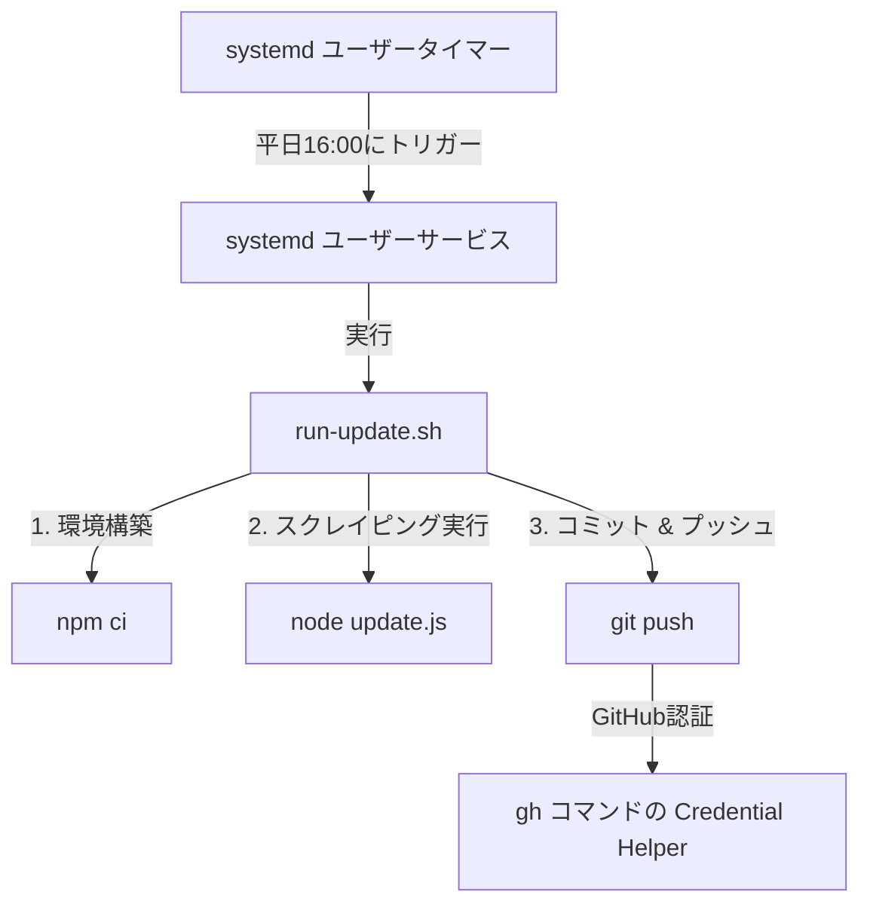

# デザイン仕様書: ローカルPC上でのsystemdによるワークフローの自動実行

## 1. 目的と背景
GitHub Actions のセルフホストランナーを使用する代わりに、ローカルPC（nuc7）上で直接 systemd のサービスおよびタイマー（timer）を使用して、データの自動収集スクリプトの実行および成果物の自動コミット・プッシュ（GitHub Actionsワークフローで行っていた処理）を定期実行する。

## 2. システム構成・設計

### 2.1 全体構成
以下の3つの要素で構成する：
1. **実行スクリプト (`run-update.sh`)**:
   リポジトリルートに配置。NVMによるNode.js環境のロード、`npm ci`による依存関係インストール、`update.js`の実行、Gitコミット＆プッシュ処理をまとめて実行する。
2. **systemd ユーザーサービス (`sectorflow-update.service`)**:
   一般ユーザー権限（`oharato`）で動作する systemd サービス。上記実行スクリプトを実行する。
3. **systemd ユーザータイマー (`sectorflow-update.timer`)**:
   上記サービスを定期実行するためのタイマー。元のワークフローのスケジュール（平日 16:00 JST）に合わせて動作する。



### 2.2 Git認証方式
* すでにローカルPC上で `gh`（GitHub CLI）による認証が設定されており、Gitのグローバル設定に `gh auth git-credential` が登録されているため、バックグラウンドでの非対話実行時も自動的に認証トークンが使用され、`git push` が成功する。

---

## 3. 各ファイルの定義

### 3.1 実行用ラッパースクリプト (`run-update.sh`)
* **配置パス**: `/home/oharato/workspace/sectorflow-jp/run-update.sh`
* **内容**:
```bash
#!/bin/bash
set -e

# エラー発生時にログを出力する関数
error_handler() {
  echo "Error occurred in run-update.sh at line $1" >&2
}
trap 'error_handler $LINENO' ERR

# リポジトリのディレクトリに移動
cd /home/oharato/workspace/sectorflow-jp

# NVM環境をロードしてNode.js/npmを使用可能にする
export NVM_DIR="$HOME/.nvm"
if [ -s "$NVM_DIR/nvm.sh" ]; then
  # shellcheck source=/dev/null
  source "$NVM_DIR/nvm.sh"
else
  echo "Error: nvm.sh not found!" >&2
  exit 1
fi

# 最新のNode環境がロードされていることを確認
echo "Using Node: $(node -v)"
echo "Using NPM: $(npm -v)"

# 依存関係のインストール
npm ci

# データ更新処理の実行
node update.js

# Gitのローカル設定（グローバル設定がない場合のエラー防止）
git config user.name "github-actions[bot]"
git config user.email "github-actions[bot]@users.noreply.github.com"

# 変更されたデータファイルをステージング
git add public/data.json public/data.js

# 差分がある場合のみコミットおよびプッシュ
if ! git diff --cached --quiet; then
  echo "Changes detected. Committing and pushing..."
  git commit -m "chore: auto-update stock data [skip ci]"
  git push
else
  echo "No data changes detected. Skipping commit."
fi
```

### 3.2 systemd ユーザーサービス (`~/.config/systemd/user/sectorflow-update.service`)
* **配置パス**: `/home/oharato/.config/systemd/user/sectorflow-update.service`
* **内容**:
```ini
[Unit]
Description=Sectorflow JP Auto Update Service
After=network.target

[Service]
Type=oneshot
WorkingDirectory=/home/oharato/workspace/sectorflow-jp
ExecStart=/home/oharato/workspace/sectorflow-jp/run-update.sh
StandardOutput=journal
StandardError=journal

[Install]
WantedBy=default.target
```

### 3.3 systemd ユーザータイマー (`~/.config/systemd/user/sectorflow-update.timer`)
* **配置パス**: `/home/oharato/.config/systemd/user/sectorflow-update.timer`
* **内容**:
```ini
[Unit]
Description=Run Sectorflow JP Auto Update scheduled task

[Timer]
# 平日（月曜日〜金曜日）の16:00 JSTに実行
OnCalendar=Mon..Fri 16:00:00
# PCが停止していたなどで実行タイミングを逃した場合、起動時に即時実行する
Persistent=true

[Install]
WantedBy=timers.target
```

---

## 4. インストール・セットアップ手順
1. **実行スクリプトの作成と権限付与**:
   * `run-update.sh` をリポジトリルートに作成。
   * 実行権限を付与: `chmod +x run-update.sh`
2. **systemd 設定ファイルの配置**:
   * `~/.config/systemd/user/` ディレクトリが存在しない場合は作成。
   * サービスファイルとタイマーファイルを配置。
3. **systemd 設定の反映と起動**:
   * systemd デーモンのリロード: `systemctl --user daemon-reload`
   * タイマーの有効化と起動:
     ```bash
     systemctl --user enable sectorflow-update.timer
     systemctl --user start sectorflow-update.timer
     ```
4. **動作確認**:
   * タイマーの有効化状態の確認: `systemctl --user list-timers`
   * 手動でのテスト実行: `systemctl --user start sectorflow-update.service`
   * 実行ログの確認: `journalctl --user -u sectorflow-update.service -n 50`

---

## 5. 懸念点・対策
* **PCのスリープ状態**:
  PCが実行予定時刻（16:00）にスリープまたはシャットダウンしていた場合、`Persistent=true` を設定しているため、次回起動時に即座に処理が実行されます。
* **ネットワーク未接続時の実行防止**:
  `After=network.target` を指定していますが、ユーザーサービスではネットワークオンライン判定が確実でない場合があります。そのため、スクリプト内で `set -e` と `trap` を用い、インターネット接続がなくてスクレイピング（`update.js` 内の axios）が失敗した場合は、エラー終了して無駄なコミットやプッシュを行わないようにします。
